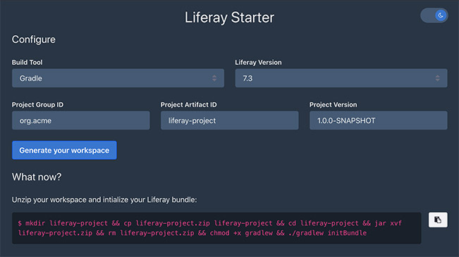

# Liferay Starter

Quickly generate & download your Liferay workspace. Inspired by [start.spring.io](https://start.spring.io/) and [code.quarkus.io](https://code.quarkus.io/).

Use it online: https://liferay-starter.lgdd.io/.



## Try it locally

Using [Docker](https://hub.docker.com/repository/docker/lgdd/liferay-starter):
```shell
docker run -it --rm -p 8000:8000 lgdd/liferay-starter
# or
docker run -it --rm -p 8000:8000 lgdd/liferay-starter:latest-jvm
```
> The default image and tag `lgdd/liferay-starter:latest` is a container image including a native executable instead of a jar. See: https://quarkus.io/guides/building-native-image.

Once the container is started, go to http://localhost:8000.

Using this repo:
```
git clone git@github.com:lgdd/liferay-starter.git
cd liferay-starter
make dev
```
> Please refer to the [Makefile](Makefile) to see the complete list of available commands.

Once the server is started, go to http://localhost:8000.

If you want to work on the frontend, run `make devFront` and go to http://localhost:3000.

## License
[MIT](LICENSE)
